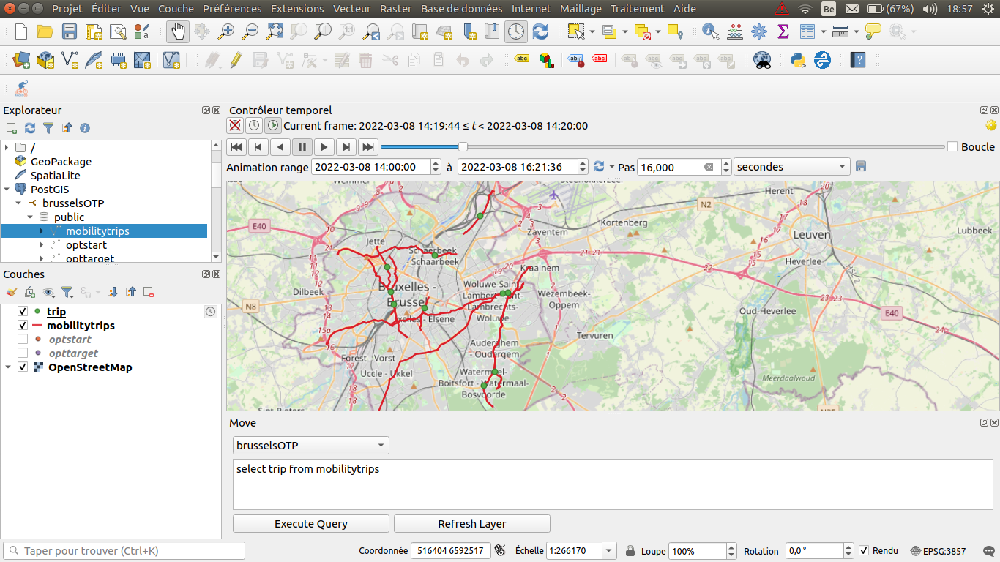

# ConnectOTP
This project aims to show you how to connect OpenTripPlanner and MobilityDB and to display the generated trips on Qgis. The generated trips are multi-modal and focus on means of transport obtained via GTFS data.

Requirements
------------

*   Linux (other UNIX-like systems may work, but remain untested)
*   Java >= 11
*   PostgreSQL >= 10
*   PostGIS >= 2.5
*	Python >= 3.0
	* As well as a compatible version of pip 
*   MobilityDB 1.0
*   JSON-C
*   QGis 3.22 Białowieża and its two modules
	* Move ( https://github.com/mschoema/move )

Building & Tutorial
-----------------------

Please follow this link	https://github.com/MaazouzMehdi/ConnectOTP/tree/main/Workshop
You will find a WorkShop explaining the different steps

Overview
-----------------------
Here you can see an overview of several routes generated by the OpenTripPlanner API and converted into MobilityDB format. This format allows us to visualize temporal points moving over time

Here you can see 35 people making a trip through the city of Brussels.
(The video has been accelerated)

Here you can see a person walking from point A to point B while a second person makes the same journey, at the same time, by public transport
(The video has been accelerated)

Here you can see a person making a trip from point A to point B
The green dot represents the person walking
The yellow dot represents the person waiting
The red dot represents the person making the trip by public transport
(The video has been accelerated)

Here you can see a lot of people making trip in Brussels
The green dot represents people walking
The yellow dot represents people waiting
The red dot represents people making the trip by public transport
(The video has been accelerated)

